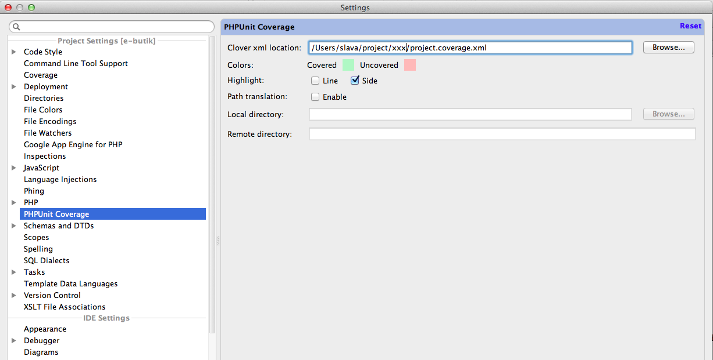
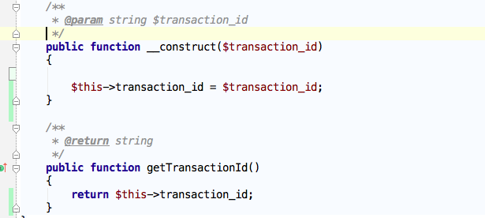
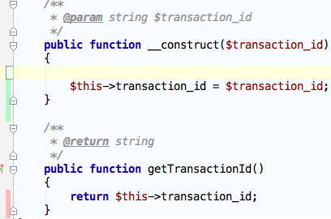

hot/phpunit-runner
==================

`Requirements: php, phpunit, git, find`

### Watcher for php classes and tests

`bin/hot-phpunit-runner --config=app/phpunit.xml --watch`

* When you change entity `XXXClass` this watcher looking for and run tests for this entity.
* When you change test for entity `XXXClassTest` this watcher run this test too.

```
PHPUnit HotRunner has been started


> phpunit -c app/phpunit.xml ./src/.../....../XXXClassTest.php

PHPUnit 3.7.21 by Sebastian Bergmann.

Configuration read from /Users/slava/project/xxx/app/phpunit.xml

....

Time: 1 second, Memory: 10.00Mb

OK (4 tests, 9 assertions)


[OK]

```

**[notice]** If you run `bin/hot-phpunit-runner` without any options then you
run all tests (or test for entity) based on `git status` (one time).
FYI, runner will not run tests next time. ( result is cached for watcher )


#### Default running looks like:

* `bin/hot-phpunit-runner --watch`
* `bin/hot-phpunit-runner --config=app/phpunit.xml --watch`

#### Options
```
 --config=app/phpunit.xml # custom phpunit config file
 --phpunit-options="-c app/ --testdox" # custom phpunit options (alternative for `--config`)
 --phpunit-bin=bin/phpunit # custom path to phpunit
 --watch # watcher mode
 --period=2 # sec. watcher period
 --clean # this option remove cached result and re-test full
 --test-similarity=100 # percentage of similarity 0..100 (entity vs test)
 --coverage=coverage.xml # collect coverage and write Clover xml
 --on-pass="echo 'pass callback';" # CLI command after pass
 --on-fail="echo 'fail callback';" # CLI command after fail
 --notify # notifications # OSX / UBUNTU notifications
```

#### Install

* composer: `"hot/phpunit-runner": "dev-master"`
* http://packagist.org/packages/hot/phpunit-runner
* https://github.com/slavahatnuke/hot-phpunit-runner

#### Workflows

1. `bin/hot-phpunit-runner --watch` # default watcher
2. `bin/hot-phpunit-runner --config=app/phpunit.xml --watch` # with phpunit config file
3. `bin/hot-phpunit-runner --config=app/phpunit.xml --phpunit-bin=bin/phpunit --watch` # with custom `phpunit`
4. `bin/hot-phpunit-runner --clean` # clear cache and re-test changeset (when watcher working)
5. `bin/hot-phpunit-runner --config=app/phpunit.xml --watch --period=1` # with phpunit config hot watcher with `--period=1`
6. `bin/hot-phpunit-runner --config=app/phpunit.xml --watch &` # with phpunit config file and with `&` (background process)
7. `bin/hot-phpunit-runner --watch --test-similarity=50` # default watcher with `--test-similarity=50` # watcher can not find my tests. I need to reduce the similarity.
8. `bin/hot-phpunit-runner --options="-c app/ --testdox" --watch` # watcher with `--options="-c app/ --testdox"` # with custom phpunit options
9. `bin/hot-phpunit-runner --config=app/phpunit.xml --coverage=coverage.xml --watch` # with `--config=app/phpunit.xml --coverage=coverage.xml`. collect coverage just for changes
10. `bin/hot-phpunit-runner --notify --watch` # OSX / UBUNTU notifications


#### PhpStorm

Highlight coverage in PhpStorm

plugin: [download](plugin/phpunit_codecoverage_display.jar)
[wiki](https://github.com/oker1/phpunit_codecoverage_display/wiki)
[home](http://plugins.jetbrains.com/plugin/6167?pr=phpStorm&showAllUpdates=true)





or




#### Notifications

`bin/hot-phpunit-runner --notify --watch`


`--notify` has dependents:

* OSX: `terminal-notifier` https://github.com/alloy/terminal-notifier
* UBUNTU: `notify-send` [man](http://manpages.ubuntu.com/manpages/hardy/man1/notify-send.1.html)
